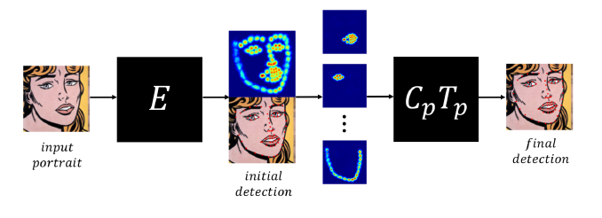

# Category Computer Vision

## CartoonGAN

### Contributions:

- A dedicated GAN-based approach that effectively learns the mapping from real-world photos to cartoon images using unpaired image sets for training
- Able to generate high-quality stylized cartoons
- When cartoon images from individual artists are used for training, our method is able to reproduce their styles
- Generative network uses a semantic loss defined as an $\ell_1$ sparse regularization in the high-level feature maps of the VGG network while discriminator network uses an edge-promoting adversarial loss for preserving clear edges
- Initialization phase leads to faster convergence of the network to the target manifold

### CartoonGAN Design

A GAN framework consists of two CNNs:

- Generator $G$: trained to produce output that fools the discriminator
- Discriminator $D$: classifies whether the image is from the real target manifold or synthetic

Solve the min-max problem
$$
(G^*,D^*)=\text{arg}\min_G\max_D\mathcal{L}(G,D)
$$
[Recommended: An intuitive introduction to GAN (Chinese)](https://zhuanlan.zhihu.com/p/33752313)

Mapping function which maps the photo manifold $\mathcal{P}$ to the cartoon manifold $\mathcal{C}$

Training data:

- $S_{data}(p)=\{p_i|i=1...N\}\subset \mathcal{P}$
- $S_{data}(c)=\{c_i|i=1...N\}\subset \mathcal{C}$

Loss function:

$\mathcal{L}(G,D)=\mathcal{L}_{adv}(G,D)+\omega\mathcal{L}_{con}(G,D)$

To comply with the fact that cartoon images have clear images, the discriminator uses binary classification that tries to assign the correct label to the following:

1. The cartoon images output by generator $G(p_k)$ and cartoon images without clear edges $e_j$
2. Real cartoon images $c_i$

#### Initialization

Since the GAN model is highly nonlinear, random initialization may cause the optimization to be trapped at local minimum.

Solution: add an initialization phase (instead of initializing randomly) by pre-training the generator network $G$ with only the semantic content loss

## Face of the Art

### Motivation

- Most algorithms for landmark detection that work well for natural images fail when applied to more realistic inputs in two domains: texture appearance differences, and geometric differences
- Large scale datasets that are necessary to train neural networks are unavailable

### Contributions

- A method for artistic facial feature detection based on neural networks
- The collection of an “artistic-faces” dataset for future research
- A method for analyzing the geometric style of artists and portraits, creating a signature of style
- **A method for geometry-aware style transfer for portraits** (our project may focus on this)

### Method

Base: ECT approach: estimation, correction, and tuning:

- Estimation: compute a global localization of each landmark based on the peak response points in the response maps, which are learned using a fully convolutional network
- Correction: a more accurate initial shape is computed by correcting outlier landmarks using a pre-trained point distribution model (PDM)
- Tuning: Landmark locations are fine-tuned based on weighted regularized mean shift

This work enhances the ETC framework by:

- using artistic augmentation in training procedure
- adding an STN component to the network and using an feature-based correction step to reduce the dependency between the different facial features

We focus on the artistic augmentation step:

- texture augmentation: needs style image and accept input for portrait only
- geometric augmentation: geometrically transform the landmarks

### Inspiration

What relates this paper with our style transfer project is its augmentation step. However, the input needs style image and portraits should be of some certain size (256*256), which is not especially helpful when dealing with the edges. Geometric augmentation is more focused on the utilization in accurate landmark detection.

## Style Mixer

