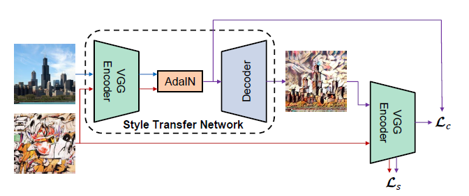

# Arbitrary Style Transfer in Real-time with Adaptive Instance Normalization

## Resources

Paper: https://arxiv.org/pdf/1703.06868.pdf

Source code (torch): https://github.com/xunhuang1995/AdaIN-style

## Introduction

Motivations:

- Neural Style transfer method proposed by Gatys et al. relies on a prohibitively slow optimization process
- Feed-forward methods are faster, but styles may be restricted

Contributions:

- Interpretation: instance normalization (IN) performs **style normalization by normalizing feature statistics**, which have been found to carry the style information of an image
- AdaIN: Given a content input and a style input, adjusts the mean and variance of the content input to match those of the style output

## Background

### Instance Normalization

$$
IN(x)=\gamma (\frac{x-\mu (x)}{\sigma (x)})+\beta
$$

Different from batch normalization, where $\mu$ and $\sigma$ are calculated through minibatches for reach channel, here they are computed across spatial dimensions independently for each channel and **each sample**
$$
\mu_{nc}(x)=\frac{1}{HW}\sum_{h}\sum_{w}x_{nchw}
$$

$$
\sigma_{nc}(x)=\sqrt{\frac{1}{HW}\sum_{h}\sum_{w}(x_{nchw}-\mu_{nc}(x))^2+\epsilon}
$$

### Conditional Instance Normalization

The layer learns a different set of parameters $\gamma^s$ and $\beta^s$ for each style $s$:
$$
CIN(x;s)=\gamma^s(\frac{x-\mu (x)}{\sigma (x)})+\beta^s
$$
Problems:

- Number of additional parameters scales linearly with the number of styles, challenging to extend their method to model a large number of styles
- Approach cannot adopt to arbitrary new styles without re-training the network

## Interpreting Instance Normalization

Experiment shows IN could perform a form of style normalization instead of a simple contrast normalization.

IN can normalize the style of each individual sample to the target style

CIN: different affine parameters can normalize the feature statistics to different values, thereby normalizing the output image to different styles

## Adaptive Instance Normalization

AdaIN has no learnable affine parameters. Instead, it adaptively computes the affine parameters from the style input:
$$
AdaIN(x,y)=\mu(y)(\frac{x-\mu (x)}{\sigma (x)})+\sigma(y)
$$

## Experimental Setup

### Architecture

First pass the content image $c$ and style image $s$ to the VGG encoder $f$ and perform AdaIN
$$
t=AdaIN(f(c),f(s))
$$
Then train a randomly initialized decoder $g$ to map $t$ back to the image space
$$
T(c,s)=g(t)
$$
It does not use normalization layers in the decoder

### Training

$$
\mathcal{L}=\mathcal{L_c}+\lambda \mathcal{L_s}
$$

where the content loss $\mathcal{L_c}=||f(g(t))-t||_2$.

Since AdaIN only transfers the mean and standard deviation of the style images, the style loss only matches these statistics.
$$
\mathcal{L}_s=\sum_{i=1}^L||\mu(\phi_i(g(t)))-\mu(\phi_i(s))||_2+\sum_{i=1}^L||\sigma(\phi_i(g(t)))-\sigma(\phi_i(s))||_2
$$
