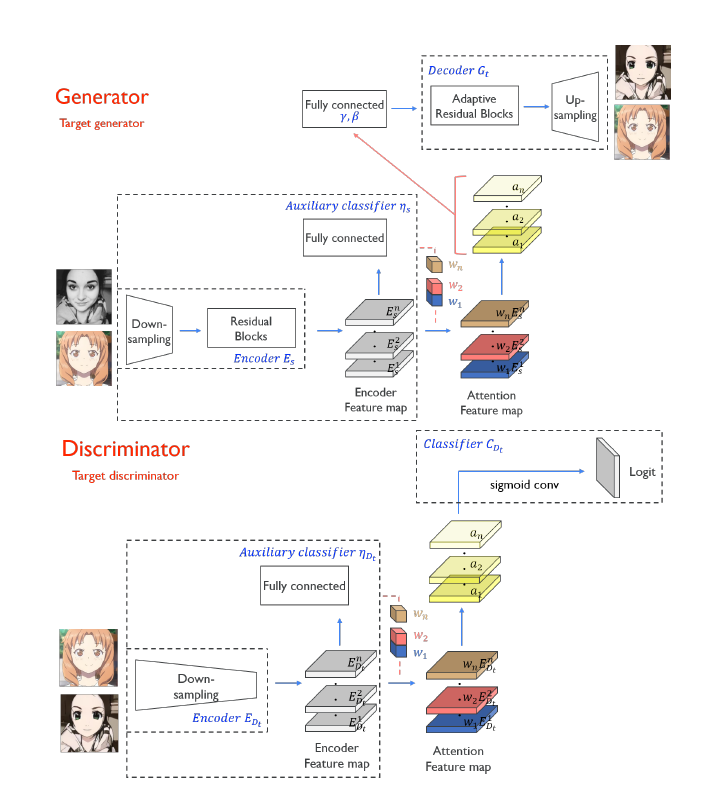

# U-GAT-IT: Unsupervised Generative Attentional Networks With Adaptive Layer-Instance Normalization For Image-To-Image Translation
## Introduction

Motivation:

- Difficult to deal with change in both shape and texture between domains
- Different kinds of image translation problems, such as image translation preserving the shape (horse2zebra) and image translation changing the shape (cat2dog), require changes in network architectures and hyper-parameters

Contribution:

- Attention module: knows where to transform intensively by distinguishing between source and target domains based on the attention map obtained by the auxiliary classifier.
- AdaLIN function helps the model to flexibly control the amount of change in shape and texture without modifying the model architecture or the hyper-parameters.

## Design

Two attention modules

- Discriminator: guides the generator to **focus on regions** that are critical to generate a realistic image
- Generator: gives attention to the region distinguished from the other domain

