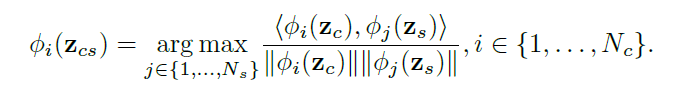
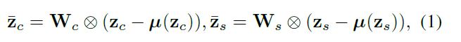
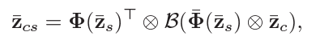
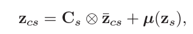
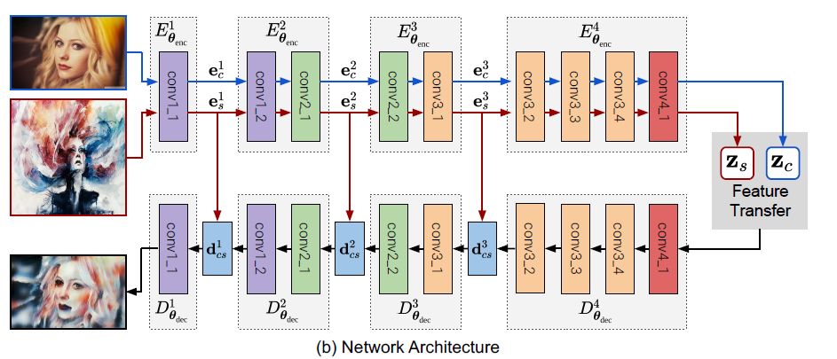
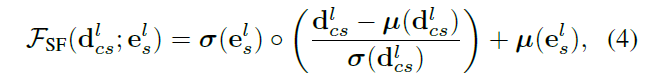

# StyleSwap, AvatarNet, WCT
All of these three papers aim at arbitrary (zero-shot) fast style transfer via different approaches of feature transformation.

Chronological: WCT->StyleSwap->AvatarNet

## Resources

StyleSwap: https://arxiv.org/pdf/1612.04337.pdf

AvatarNet: http://openaccess.thecvf.com/content_cvpr_2018/CameraReady/0137.pdf

WCT: https://arxiv.org/pdf/1705.08086.pdf

## StyleSwap

Select patches from both content and style images and match using Normalized Cross-correlation (NCC)

## AvatarNet

Two parts:

- Bottleneck layer: feature decorator, (argued) better than NCC
- Encoder: Hourglass network, does multi-scale fusion

### Problems of NCC

- Highly biased toward the **content features**, since it suggests the matched style patches strictly follow the local variations as the content patches.
- Only a limited portion of style patterns are parsed to assemble $\mathbf{z}_{cs}$ when the domain of $\mathbf{z}_{c}$ and that of $\mathbf{z}_{s}$ are far apart

### Style Decorator

Projection:

$W$ are derived by whitening matrices onto the covariance matrices

The projected feature maps keep the characteristics of the original data, but both of them statistically follow standard normal distribution

Matching and reassembling:

Reconstruction:

- Projection and reconstruction steps are designed to encourage that the second-order statistics of the stylized feature $\mathbf{z}_{cs}$ to be matched to those of the style feature $\mathbf{z}_{s}$.
- Matching and reassembling step pairs the elements in $\mathbf{z}_c$ and $\mathbf{z}_{s}$ by matching their normalized counterparts, thus it  effectively reduces the bias and enriches the parsing diversity, which is more effective than StyleSwap.

### Hourglass Encoder

Fuse $e_s^l$ and $d_{cs}^l$ by AdaIN

