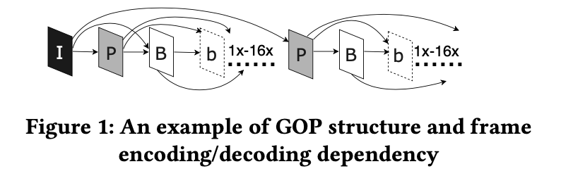
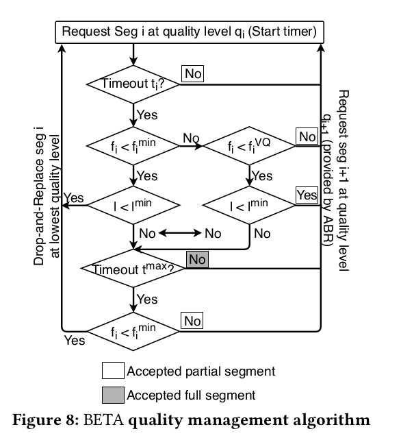

# BETA

Link to paper: https://dl.acm.org/doi/pdf/10.1145/3304109.3306235?download=true

## Motivation

- The buffer depletes due to one fundamental reason – the client commits to downloading the segment that cannot complete before it is due to play

- Current VoD services:

  - Maintain a large buffer: waste of bandwidth
  - Replace original chunks with those of low quality: still does not guarantee stall-free experience

  Also, these methods result in lower visual quality (VQ)

- An ideal solution to live broadcasts' high requirement of low latency should be agile and robust to bandwidth variation in real time, and mitigate the consequences of sudden bandwidth reduction in a graceful manner

- Bandwidth Efficient Temporal Adaptation: enables HAS systems to adjust quality **at sub-segment granularity** and to play partially received segments by **exploiting temporal property**.

## Contribution

- Proposed a concept of sub-segment temporal adaptation, which faciliates loss-tolerant HAS based on new importance-based transmission order of video frames that allows partial segment decoding
- Introduced VQ threshold metric
- BETA can be used to reduce the set of encoding bitrates for a HAS stream to save on storage demands

## Video Coding Basics

The sequence of source video frames is converted into a coded bitstream and then transmitted over the network. The coded bitstream is a sequence of GOPs, each consisting a number of coded frames.

- I-frame: indicates the beginning of a GOP, references P, B, b-frames
- P-frame: depends on the I-frame, references B, b-frames
- B-frame: depends on the I-frame and P-frame(s), references b-frames
- b-frame: depends on the I-frame, P-frames(s) and B-frame(s), references nothing

Each GOP contains an I-frame, followed by a series of PBb sequences, where the number of non-reference b-frames could be anywhere between 1 and 16.

- Closed GOPs are used (with no temporal dependency across GOPs)
- GOP length is fixed
- GOP structure is fixed

## BETA Design Overview

Motivating questions:

- How can we help the client decode and play a partial segment, and discard some part of it when needed, to avoid a stall in the case of a sudden bandwidth reduction?
- Can we dynamically adjust the quality of the segment being downloaded by manipulating the temporal property?

Problems:

- A segment (containing one or a few GOPs) must be completely downloaded to be decoded
- Using QUIC cannot eliminate Head-of-Line Blocking (HoLB). It will exist at the segment level at the application layer, as next chunk cannot be played, even if delivered, until previous one has played fully.

### Sub-segment Level Quality Adjustment

Frames in each segment are ordered according to their importance in the decoding process and are transmitted in this particular order to the client over HTTP

### VQ Threshold

- A VQ threshold that defines the number of frames in each segment (in BETA-order) that must be received, so that the impact on VQ is minimized
- VQ threshold is determined on the server side while encoding the video, and is used by the BETA client-side algorithm to terminate the segment download

## BETA Server

### Redefining Transmission Order

- Arrange I-frames first, then P-frames and B-frames, b-frames at last
- Experiment shows that the percentage of b-frames that can be dropped without affecting VQ should be computed per segment

### Opportunity: Reducing the Bitrate Set

Intermediate chunks can be dropped since their bitrates are covered by their respective next higher quality levels. The selection should be done by video content providers

### VQ Threshold

- Since scarification in visual quality can vary significantly among segments, we need to determine the acceptable VQ loss to balance visual quality (higher PSNR and SSIM) and stability
- Define VQ threshold, $f_i^{VQ}$ as the percentage of b-frames that must be received to ensure equal or better visual quality than the next lower quality level
- Per-segment $f_i^{VQ}$ values are included in the modified MPD file

## BETA Client

Client side should:

- know the VQ threshold for each segment
- have the BETA quality management algorithm that controls the appropriate actions at sub-segment granularity
- monitor the progress of the downloads, so it can drop and replace the current segment as a last resort
- be able to play the partial segment

### Per-segment Timeout

Due to VBR, for a fixed average available bandwidth, chunk (segment) size could be different.

Timeout $t_i=\frac{s_i}{b_i}$, where $s_i$ is segment size and $b_i$ is average available bandwidth.

### BETA Quality Management Algorithm

Purpose of BETA algorithm: decide if there is a need to drop the tail of the segment and whether it is possible to do so. Achieved by comparing the download progress with the timeout parameters and VQ threshold for possible quality tuning.

